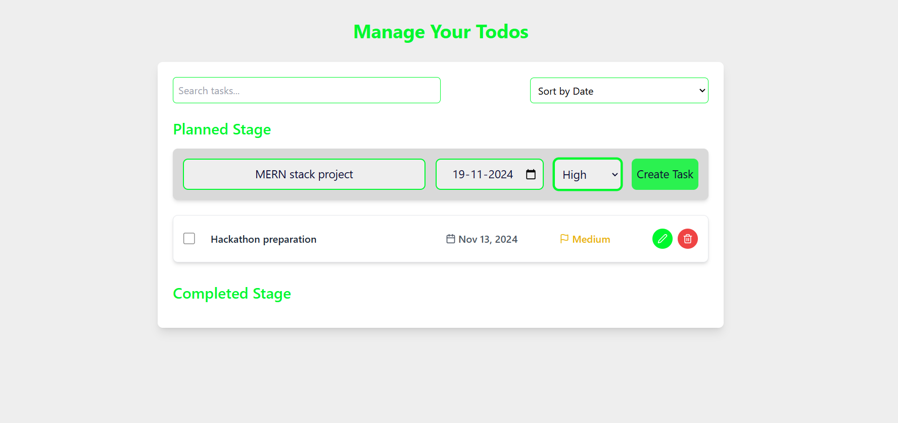

# Todo App with React and Vite

A task management application built with **React** and **Vite**, leveraging **Redux Toolkit** for state management. This app allows users to create, edit, and manage tasks with a variety of features, such as filtering and sorting by priority or date.

## 1. Application and Functionality

### Overview

The **Todo App** provides an intuitive interface for users to manage their tasks. Users can add, edit, and delete tasks, as well as mark them as completed. The app also features:

- **Search**: Filter tasks by searching for specific text.
- **Sort**: Sort tasks by priority (High, Medium, Low), date, or recent additions.
- **Task Stages**: View tasks in the **Planned Stage** (incomplete tasks) and **Completed Stage** (tasks marked as completed).
- **Priority System**: Tasks can be assigned a priority level (Low, Medium, High), which is visually indicated.
- **Responsive Design**: The app is fully responsive, optimized for both desktop and mobile devices.

### Key Features

- **Task Management**: Add, edit, and delete tasks.
- **Task Filtering**: Search for tasks by their text.
- **Sorting Options**: Sort tasks by priority, date, or by most recent.
- **Visual Indicators**: Tasks are color-coded based on priority.
- **Task Completion**: Mark tasks as completed and view them in the Completed Stage.
- **Redux State Management**: The app uses Redux Toolkit to handle the state of tasks across the application.

## 2. Setup and Launch Process

### Prerequisites

Before you can run the app locally, you’ll need to have the following installed:

- **Node.js** (version 14 or above)
- **npm** (or Yarn, if you prefer)

### Installation

1. Clone the repository to your local machine:

    ```bash
    git clone https://github.com/surajverma-07/TaskManager.git
    ```

2. Navigate into the project directory:

    ```bash
    cd TaskManager
    ```

3. Install the project dependencies:

    ```bash
    npm install
    # or if you prefer Yarn
    yarn install
    ```

### Development

To start the development server, run:

```bash
npm run dev
# or
yarn dev
```

This will start the Vite development server, and you can view the app at [http://localhost:5173](http://localhost:5173).

## Build for Production

To build the app for production, use:

```bash
npm run build
# or
yarn build
```

This will generate an optimized production build in the `dist/` folder.

To preview the production build locally:

```bash
npm run preview
# or
yarn preview
```

## 3. Assumptions Made During Development

While building this application, the following assumptions were made:

- **Browser Compatibility**: The app supports modern browsers (Chrome, Firefox, Safari, Edge). Older browsers like Internet Explorer may not work properly.
- **Local Storage**: The app assumes that tasks are stored using Redux and will persist within the session (using Redux state management).
- **No Backend**: This is a frontend-only application. Task data is stored in Redux and does not persist after a page reload unless you implement local storage or a backend.
- **Responsive Design**: The app is designed to be responsive, but may not function well on older mobile browsers that don’t support newer CSS features (e.g., Flexbox or Grid).
- **Redux Toolkit**: The app assumes familiarity with Redux Toolkit for state management. If Redux is not properly set up, the app will not function as expected.

## 4. Screenshots

Here are some screenshots of the app in action:

### Screenshot 1: Task Management (Adding a task)


### Screenshot 2: Completed and Filtering Tasks


### Screenshot 3: Search a task


(You can replace the screenshot paths with your actual images, or add additional screenshots as necessary.)

---

## Folder Structure

Here’s an overview of the project structure:

```bash
src/
├── assets/              # Images or other static assets
├── components/          # Contains the main React components
│   ├── AddTodo.jsx      # Component for adding a new todo
│   ├── Todos.jsx        # Component for displaying individual todos
├── store/               # Redux store and taskSlice for state management
│   ├── store.js         # Redux store setup
│   └── taskSlice.js     # Slice containing tasks' state logic
├── App.jsx              # Main app component
├── App.css              # App-specific styles
├── index.css            # Global styles
└── main.jsx             # Entry point for the app
```
